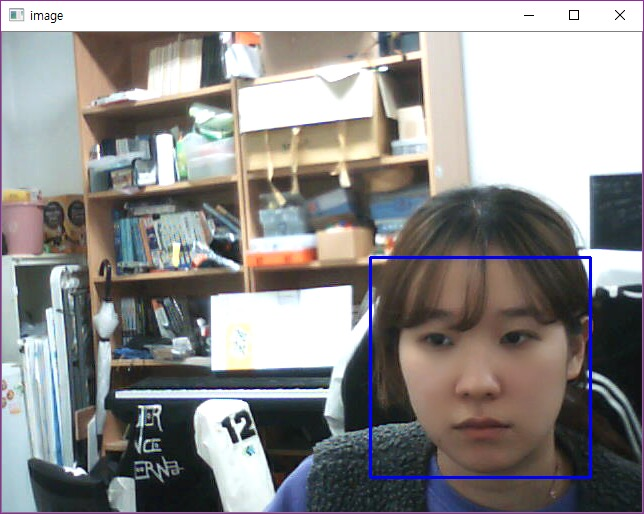
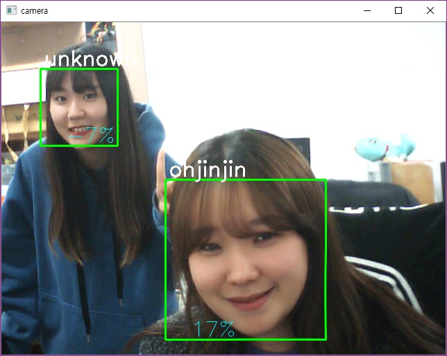

# SmartVideoPhone_Server
This Project's name is a SmartVideoPhone for Women.

The server detects and recognizes the face using the Harr Cascade algorithm with OpenCV.

## collect datas for training
We can get 30 images for training like following image after executing **collect_datas.py**

collect training datas by detecting only the face part while shooting like this :
> Until this time, the server can only do face detection.

then the set of datas for training is created.

## train datas for training
run **recognize.py** after run **train_datas.py** to training using these datas.
> After executing train_datas.py, A Yaml file is created.

We can see the face recoginition works well.

More datas Better result.

Using this, the whole project will identify whether the guest who visited my house is a stranger or a courier and notify to Android Application.

## implement tcp/ip socket for network between Android and Server
The SmartVideoPhone project has three module, Server, Android and H/W on RaspberryPi.
The Android part requires two sockets. One of them is for raspberrypi and The other is for Server.
So We need to implement TCP/IP server socket and client socket in server program.
Here's the server program, **recog_text.py**.

This server program and Android programming enable face recognition asynchronously.

## references
 post of own blog URL : [https://ohjinjin.github.io/projects/SmartVideoPhone/](https://ohjinjin.github.io/projects/SmartVideoPhone/) 
 video of execute URL : [https://youtu.be/wLMCrnUK-1c](https://youtu.be/wLMCrnUK-1c) 
 
